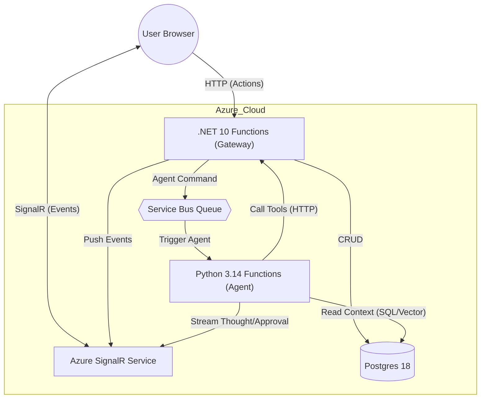

### System Architecture

| Feature | Tech Stack | Description |
| :--- | :--- | :--- |
| **Frontend** | **Angular 21** | Standalone, zoneless, signal-based architecture. |
| **API Gateway** | **.NET 10 Functions** | Isolated Worker. Handles CRUD, Auth, and Orchestration. |
| **Realtime** | **Azure SignalR** | Serverless Mode. Pushes updates to clients. |
| **Messaging** | **Service Bus** | Decouples API from AI worker. |
| **Database** | **Postgres 18** | Relational data + `pgvector` for embeddings. |
| **Auth** | **Easy Auth** | App Service Authentication (Entra ID). |
| **AI Agent** | **Python 3.14 + Pydantic AI** | Agentic workflow, Tool Calling, and Human-in-the-loop. |

### Data Flow

#### 1. User Actions (Standard CRUD)
*User moves a ticket from "Todo" to "In Progress"*
1. **Angular** sends `PUT /api/tickets/{id}` to **.NET Function**.
2. **.NET Function** updates **Postgres**.
3. **.NET Function** uses `SignalR Output Binding` to broadcast "TicketMoved" event.
4. Other users' **Angular** apps receive event and update UI instantly.

#### 2. Collaboration (Invites)
*User wants to join a project via Link*
1. **Host** shares link: `https://syncflow.app/join/proj-guid-123`.
2. **Guest** logs in and clicks "Request Access".
3. **Angular** sends `POST /api/projects/{id}/join` -> **.NET** creates `JoinRequest`.
4. **Host** receives **SignalR** notification: "User X wants to join".
5. **Host** clicks "Approve" -> **.NET** adds `ProjectMember` and notifies Guest.

#### 3. Agentic Workflow (Natural Language CRUD & RAG)
*User asks: "Delete all tickets in the 'Done' column"*
1. **Angular** sends prompt `POST /api/agent/command` to **.NET Function**.
2. **.NET Function** pushes request to **Service Bus** (`q-agent-commands`).
3. **Python Function** (Pydantic AI Agent) is triggered.
4. **Agent Logic (Hybrid Router)**:
   - **Scenario A (Explicit)**: "Delete 'Done' tickets" -> Router selects `run_sql_query` tool -> `SELECT * FROM Tickets WHERE Status = 'Done'`.
   - **Scenario B (Vague)**: "Delete boring tasks" -> Router selects `vector_search` tool -> Finds tasks with "boring" semantic match.
   - **Scenario C (Composite)**: "Delete boring tasks in 'Done' column" -> Router calls *both* or filters SQL results with vector search.
5. **Human-in-the-Loop**: Pushes "Approval Request" with the list of impacted items via **SignalR**.
6. **User** clicks "Approve".
7. **Agent** calls `delete_ticket` tool (via **.NET API**) for the approved IDs.

---

### Architecture Decisions & Q&A

**Q: Why Pydantic AI?**
* Provides a type-safe, composable way to build agents using Python.
* Native support for **Dependency Injection** (`RunContext`), making it easy to pass database connections or API clients to tools.
* Structured state management for **Human-in-the-loop** flows.

**Q: Hybrid RAG vs. SQL?**
* **Vector Search**: Best for vague, semantic, or unstructured queries ("Find tasks about UI bugs", "Suggest a refactor").
* **Read-Only SQL Tool**: Best for explicit, structured queries ("Count tasks in column X", "Find tickets created yesterday").
* The **Agent** decides which tool to use based on the user's prompt. Pydantic AI excels at this tool selection.

**Q: How does the AI "Call" .NET?**
* The Python Agent's tools are simple Python functions decorated with `@agent.tool`.
* Inside these tools, we use `httpx` to call the internal .NET API endpoints.
* **Benefit**: We don't duplicate business logic (permissions, validation) in Python. Python just acts as an intelligent operator of the .NET API.

**Q: When should SignalR be used vs regular API calls?**
* **API Calls (HTTP)**: Use for all *client-initiated* actions (creating a task, approving an AI plan).
* **SignalR (WebSockets)**: Use primarily for *server-initiated* push notifications (AI streaming response, approval requests, live updates).

**Q: Why doesn't Python use Service Bus to call .NET?**
* **Tool Execution is Synchronous**: When the Agent runs a tool (e.g., "DeleteTicket"), it needs to know the result (Success/Error) *immediately* to decide its next step.
* **Service Bus is Async**: Using queues for acting on tools would require complex "Request/Reply" patterns and add unnecessary latency.
* **HTTP is Symmetrical**: The Python Agent acts just like another "Client" (like Angular). It sends a request and gets a response.

**Q: Does the Agent "steal" User Auth? (Security Protocol)**
* **No**. The Python Agent uses the **Trusted Subsystem** pattern.
* **Architecture**: The Python Worker is a "privileged" internal service. It authenticates to .NET using a secure **Function Key** (System-to-System trust).
* **Impersonation**: It passes a custom header `X-SyncFlow-Acting-User-Id` containing the original User ID from the Service Bus message.
* **.NET Guardrails**: 
    1. The .NET Middleware verifies the Function Key (rejects public access).
    2. It trusts the `Acting-User-Id` header only from this specific worker.
    3. It hydrates the `ClaimsPrincipal` for that user.
    *   **Result**: The code executes *as if* the user clicked the button, enforcing all RLS (Row Level Security) and logic. The Agent cannot access data the user couldn't access themselves.

---

